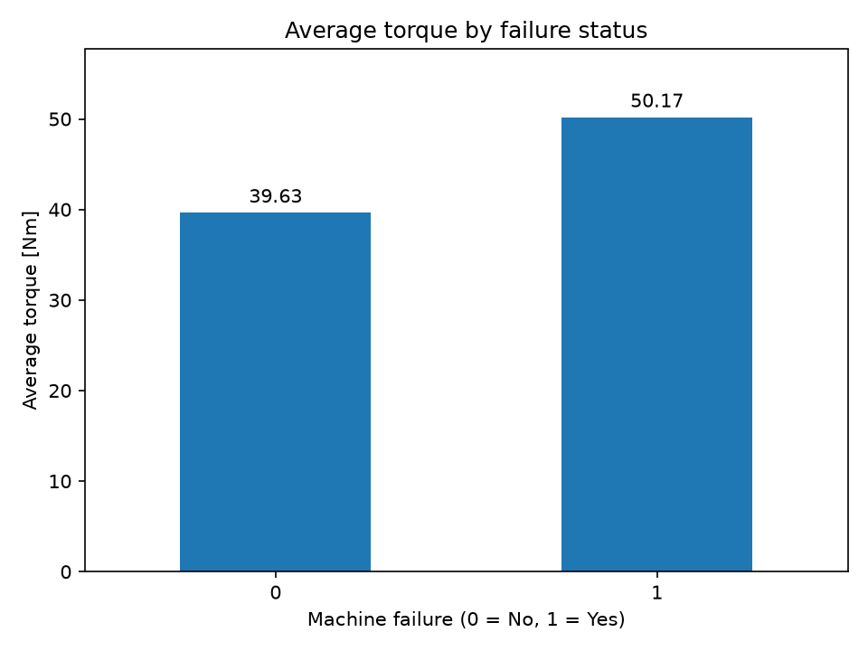
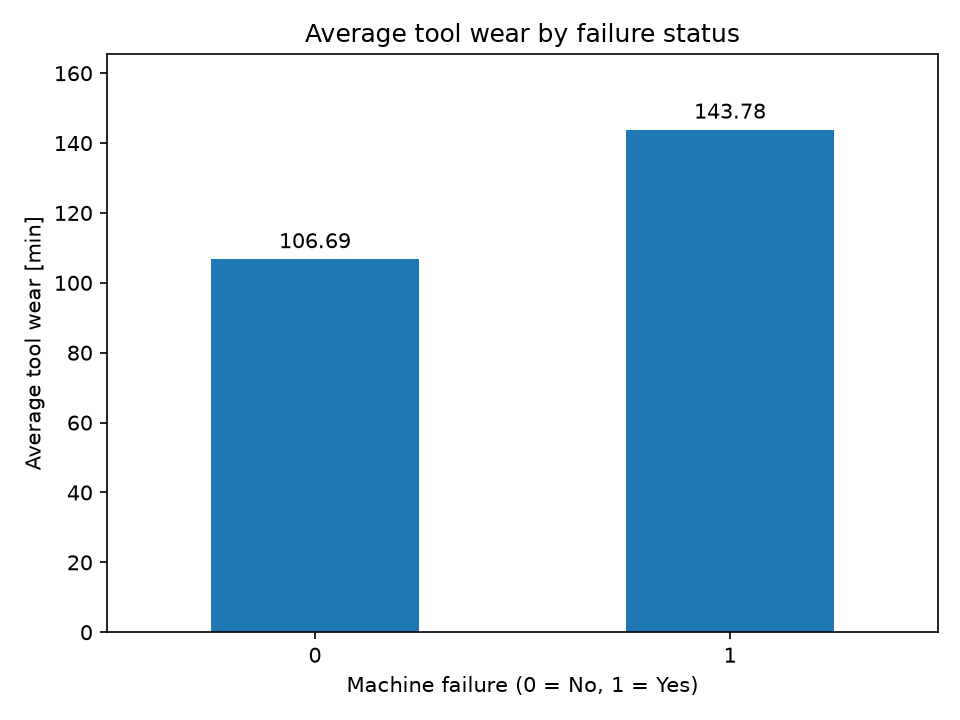
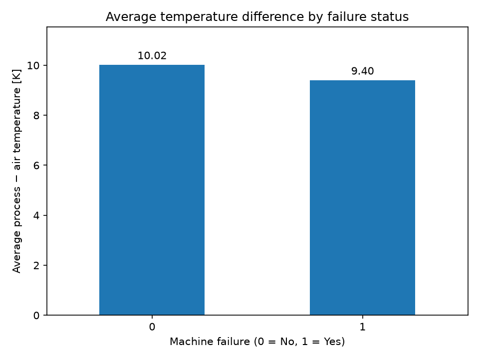
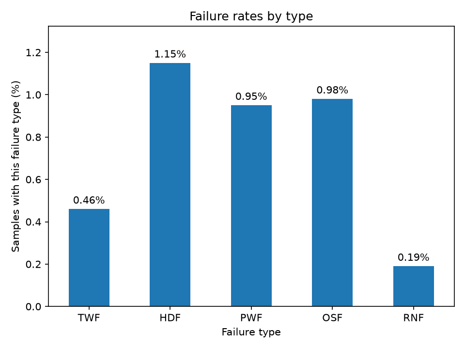

# Machine Failure Analysis with Python

Exploratory analysis of machine failure data using pandas and Matplotlib.

## Objectives

- Load and inspect the AI4I 2020 Predictive Maintenance dataset.
- Calculate the overall machine failure rate and rates for each failure type.
- Compare average torque, tool wear, and temperature difference between samples with and without machine failure.
- Visualize failure rates by type.

## Tools

- Python
- pandas
- Matplotlib

## Analysis

Machine failure status is represented by:

- `0`: No machine failure
- `1`: Machine failure

Temperature difference is calculated for each sample as:

`Process temperature [K] − Air temperature [K]`

Average measurements are compared by machine failure status.
The temperature difference chart includes all machine failures; it is not an analysis restricted to HDF.

## Results

- Total samples: 10,000
- Samples with machine failure: 339
- Samples without machine failure: 9,661
- Overall machine failure rate: 3.39%
- No missing values were found.

### Failure rates by type

Each rate is calculated relative to all 10,000 samples.
A sample can have more than one failure type, so these percentages should not be added to calculate the overall machine failure rate.

| Failure type | Rate (%) |
| --- | --- |
| TWF | 0.46 |
| HDF | 1.15 |
| PWF | 0.95 |
| OSF | 0.98 |
| RNF | 0.19 |

### Comparison of averages

| Measurement | Without failure | With failure |
| --- | --- | --- |
| Torque (Nm) | 39.63 | 50.17 |
| Tool wear (min) | 106.69 | 143.78 |
| Rotational speed (rpm) | 1540.26 | 1496.49 |

Samples with failure had higher average torque and tool wear,
and lower average rotational speed.

Average temperature differences are shown in the chart below
and saved in `comparison_summary.csv`.

These comparisons describe associations and do not establish causation.
This project performs exploratory analysis and does not train a prediction model.

## Charts

### Torque



### Tool wear



### Temperature difference



### Failure rates by type



## How to run

1. Install Python.
2. Download or clone this repository.
3. Ensure `ai4i2020.csv` is in the same folder as `main.py`.
4. Open a terminal in the project folder.
5. Install the required libraries:

```bash
python -m pip install -r requirements.txt
```

6. Run the analysis:

```bash
python main.py
```

Close each chart window to continue to the next chart.
The script prints analysis results and saves CSV tables and PNG charts
in the current working directory.

## Output files

| File | Contents |
| --- | --- |
| `comparison_summary.csv` | Average torque, tool wear, rotational speed, and temperature difference by failure status |
| `failure_type_rates.csv` | Percentage of all samples with each failure type |
| `average_torque.png` | Average torque by failure status |
| `average_tool_wear.png` | Average tool wear by failure status |
| `average_temperature_difference.png` | Average process minus air temperature by failure status |
| `failure_type_rates.png` | Failure rates by type |

## Dataset source

AI4I 2020 Predictive Maintenance Dataset (2020).
UCI Machine Learning Repository.

- Dataset: https://archive.ics.uci.edu/dataset/601/ai4i
- DOI: https://doi.org/10.24432/C5HS5C
- License: CC BY 4.0
- License link: https://creativecommons.org/licenses/by/4.0/

The dataset contains 10,000 synthetic samples representing
industrial predictive maintenance conditions.

The original CSV is used without modification.
Temperature difference is calculated during analysis as an additional column.
